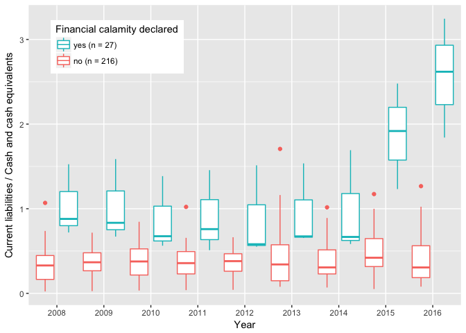

This package aims to make available in machine readable format regional
discriminated data on the fiscal variables that are needed to compute
the fiscal indicators used by the Brazilian National Treasury
Secretariat (NTS) for payment capacity evaluation.

Installation
============

This package can be installed directly from GitHub using `devtools`:

    if (!require("devtools")) {
        install.packages("devtools")
    }
    devtools::install_github("fjuniorr/junior2017")

Alternatively, a `csv` file with the dataset can be downloaded
[here](https://github.com/fjuniorr/junior2017/raw/master/data-raw/fiscal_data.csv).

Code examples
=============

The dataset documentation can be accessed with

    library(junior2017)
    ?fiscal_data

As an example of using the data, figure 3.1*c* of Junior (2017) can be
reproduced with

    library(ggplot2)

    data("fiscal_data")

    ggplot(fiscal_data, aes(x = factor(year), y = capag_il, color = state_calamity)) +
        geom_boxplot(position=position_dodge(1)) +
        xlab("Year") + 
        ylab("Current liabilities / Cash and cash equivalents") +
        theme(legend.position=c(0.05,0.95), legend.justification=c(0,1)) +
        theme(panel.border = element_blank()) +
        scale_color_discrete(name = "Financial calamity declared", labels = c("no (n = 216)", "yes (n = 27)")) +
        guides(color=guide_legend(reverse=TRUE))

References
==========

Junior, Francisco Alves de Oliveira. 2017. “Assessing Fiscal Distress in
Subnational Governments: The Case of Brazil.” Master’s thesis,
Department of Economics; Related Studies - University of York.
